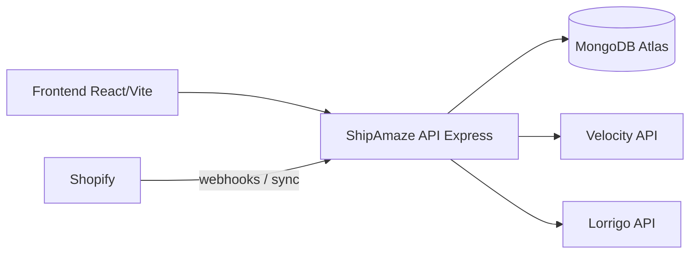
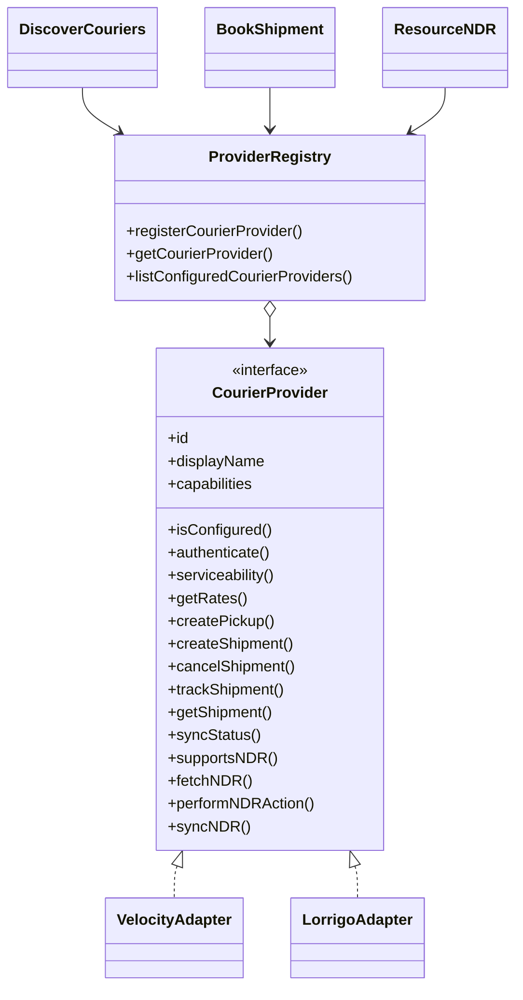
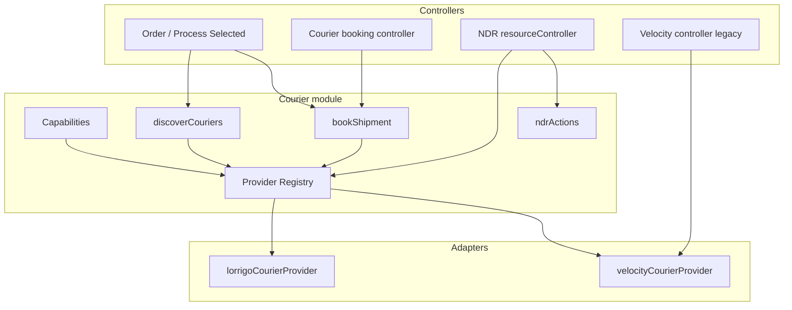

# ShipAmaze Multi-Provider Architecture (Final)

## System context

## Provider architecture

## Runtime data flow

## Background workers (`server.ts`)

| Job | Interval | Provider |
|-----|----------|----------|
| Status sync | 5 min | Velocity |
| Status sync | `LORRIGO_STATUS_SYNC_INTERVAL_MS` (default 5 min) | Lorrigo |
| NDR sync | 10 min | Velocity |
| NDR sync | `LORRIGO_NDR_SYNC_INTERVAL_MS` (default 10 min) | Lorrigo |
| Failure remarks | 10 min | Velocity |
| Shopify order sync | 5 min | Shopify |

## Feature flags

| Flag | Effect |
|------|--------|
| `LORRIGO_ENABLED` | Registers Lorrigo provider; gates pickup/booking/sync |
| `VELOCITY_ENABLED` | Production credential validation (does not fully unregister) |
| `COURIER_DISCOVERY_MODE` | `velocity` \| `lorrigo` \| `both` |

## Non-negotiable rules

1. Controllers resolve providers via the registry — never hardcode Lorrigo/Velocity modules for new features.
2. Prefer `capabilities.*` / `supportsNDR()` over `provider === "…"`.
3. Local pickup/order state wins on sync failure.
4. Never log tokens, passwords, or raw auth bodies.
5. Provider timelines are append-only (`providerEvents`).

See also: [multi-provider-architecture.md](./multi-provider-architecture.md), [sequence-diagrams.md](./sequence-diagrams.md).
