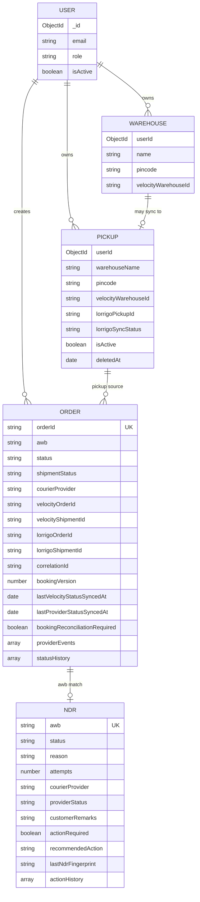

# Entity Relationship Diagram (Courier-focused)



## Key relationships

- **Order ↔ NDR**: matched by `awb` / `trackingId` (not a formal FK).
- **Order.courierProvider**: `"velocity"` \| `"lorrigo"` — selects adapter for track/cancel/NDR actions.
- **Pickup.lorrigoPickupId**: required before Lorrigo booking.
- **providerEvents**: embedded timeline on Order (capped at 100).

## Recommended indexes (Phase 8)

```js
// Order — status sync fairness
{ courierProvider: 1, status: 1, lastProviderStatusSyncedAt: 1 }
{ status: 1, awb: 1, lastVelocityStatusSyncedAt: 1 }
{ velocityOrderId: 1 } // sparse

// NDR — Active list
{ status: 1, updatedAt: -1 }
```
