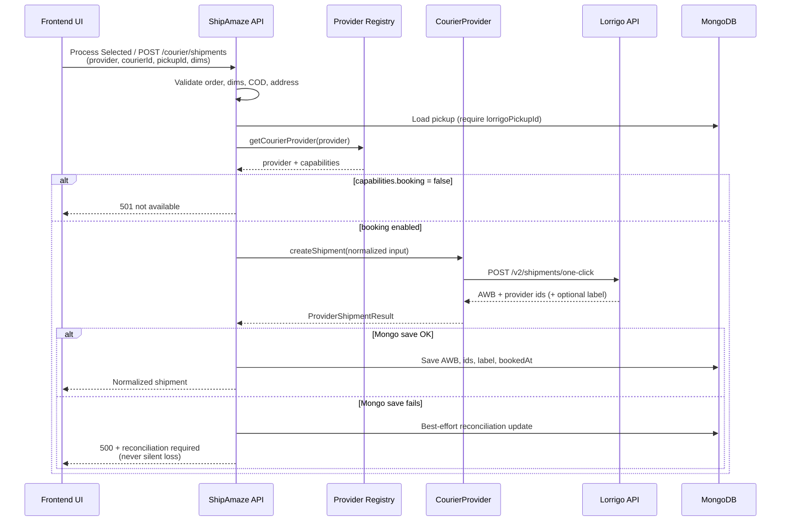
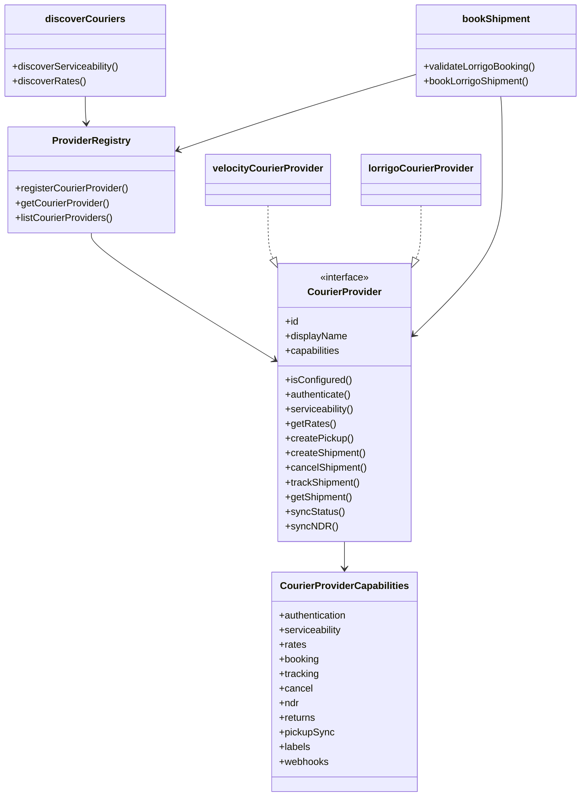

# Multi-Provider Courier Architecture

## Sequence — multi-provider booking

Velocity booking still uses `bookForwardShipmentForOrder` / `POST /api/velocity/forward/create` unchanged. Lorrigo uses the orchestrator above.

## Class / component — provider architecture

## Migration guide — Velocity-only → provider-based

| Old (Velocity-only) | New (multi-provider) |
|---------------------|----------------------|
| `POST /api/velocity/serviceability` | Prefer `POST /api/courier/serviceability` (aggregates by `COURIER_DISCOVERY_MODE`) |
| `POST /api/velocity/rates` | Prefer `POST /api/courier/rates` |
| `POST /api/velocity/forward/create` | **Unchanged** for Velocity. Lorrigo: `POST /api/courier/shipments` with `provider: "lorrigo"` |
| Process Selected always Velocity | Pass `provider: "lorrigo"` when a Lorrigo courier is selected; omit / `velocity` keeps old path |
| Pickup must have `velocityWarehouseId` | Velocity: same. Lorrigo: require `lorrigoPickupId` + successful sync |
| Order fields: `velocityOrderId`, `awb`, … | Plus optional `courierProvider`, `lorrigoOrderId`, `lorrigoShipmentId`, `bookedAt`, `bookingReconciliationRequired` |
| UI: `if (provider === "lorrigo")` | Prefer `providerSupports(provider, "booking")` via capability registry |

Backward compatible: existing Velocity orders and APIs keep working with no changes.

## Rollback plan — disable Lorrigo instantly

1. **Feature flag (primary):** set `LORRIGO_ENABLED=false` and restart the API.  
   - Lorrigo is not registered.  
   - Pickup sync skipped.  
   - Discovery mode `both` falls back to Velocity only.  
   - Process Selected / `/courier/shipments` with `provider=lorrigo` returns 503.

2. **Discovery-only rollback:** set `COURIER_DISCOVERY_MODE=velocity` so UI stops listing Lorrigo couriers while leaving auth/pickup sync alone.

3. **Do not delete data:** optional fields (`lorrigoPickupId`, `lorrigoOrderId`, etc.) remain; they are ignored when the flag is off.

4. **Velocity unaffected:** `/api/velocity/*` and Process Selected without `provider=lorrigo` continue as before.

## Observability (Phase 6)

| Field | Purpose |
|-------|---------|
| `correlationId` | One id from booking → tracking → cancel → logs |
| `bookingVersion` | Payload schema version at book time (currently `1`) |
| `providerEvents[]` | Append-only timeline (`BOOKING_REQUEST`, `BOOKING_RESPONSE`, `STATUS_CHANGE`, …) |
| `lastProviderStatusSyncedAt` | Fair-rotation cursor for Lorrigo polls |

Lorrigo status polling: `LORRIGO_STATUS_SYNC_INTERVAL_MS` (default 5 minutes). Health: `GET /api/lorrigo/status` → `sync.activeShipments`, `lastPollAt`, `consecutiveFailures`, etc.
