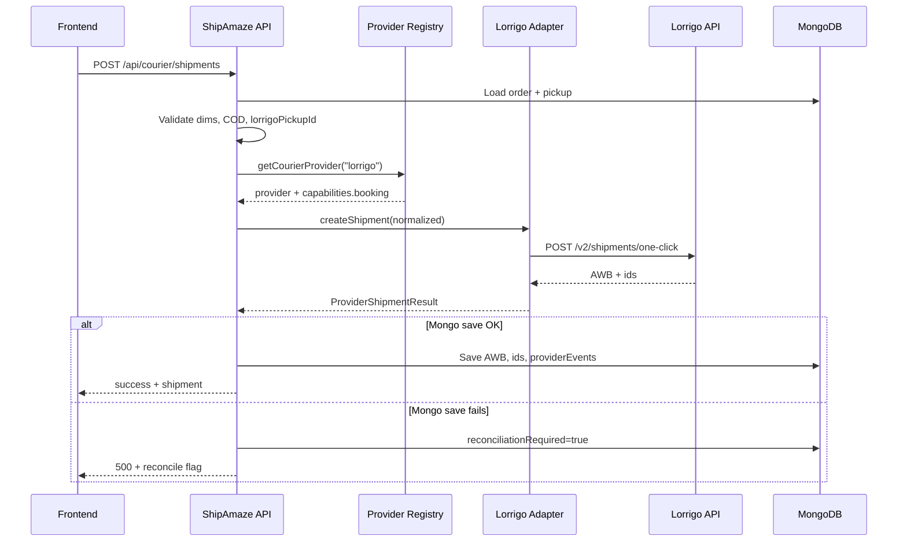
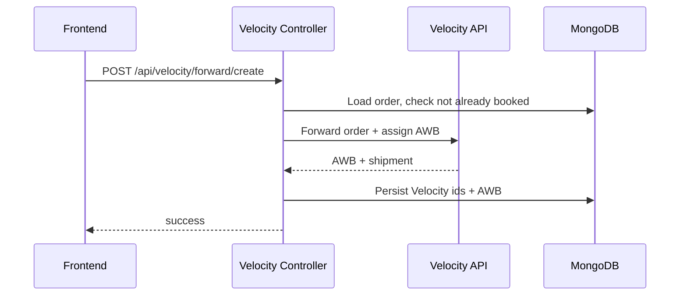
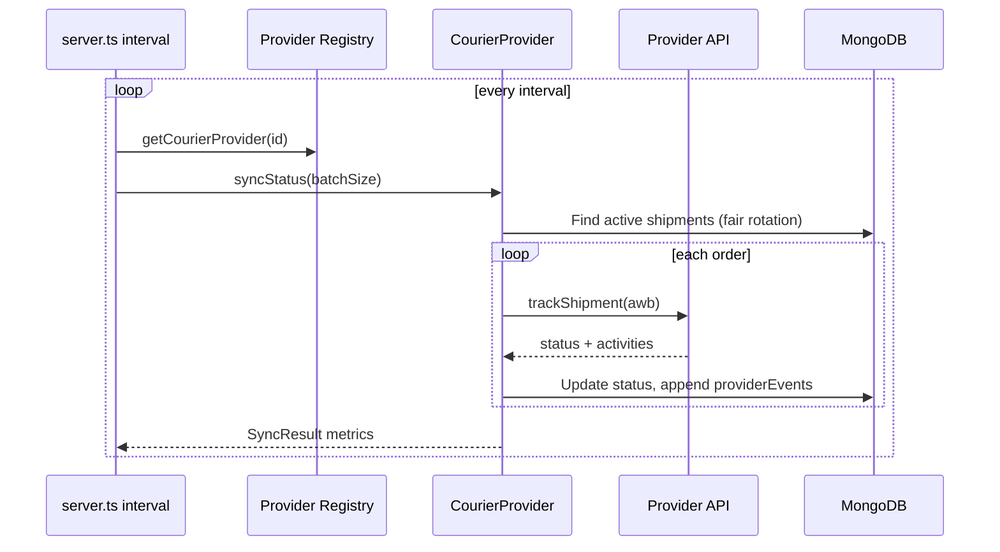
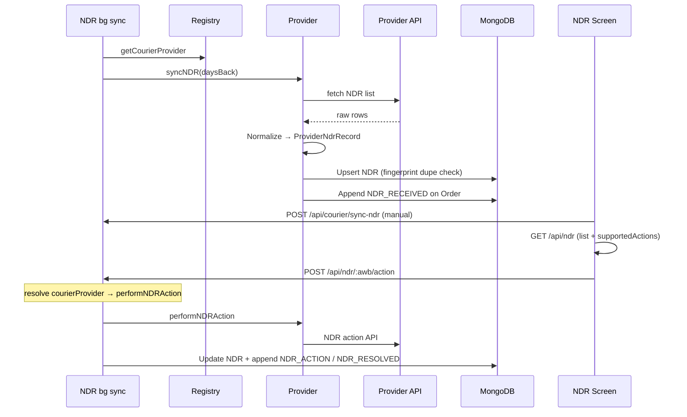

# Sequence Diagrams

## Booking — Lorrigo (orchestrator)

```mermaid
sequenceDiagram
  participant UI as Frontend
  participant API as ShipAmaze API
  participant REG as Provider Registry
  participant P as Lorrigo Adapter
  participant L as Lorrigo API
  participant DB as MongoDB

  UI->>API: POST /api/courier/shipments
  API->>DB: Load order + pickup
  API->>API: Validate dims, COD, lorrigoPickupId
  API->>REG: getCourierProvider("lorrigo")
  REG-->>API: provider + capabilities.booking
  API->>P: createShipment(normalized)
  P->>L: POST /v2/shipments/one-click
  L-->>P: AWB + ids
  P-->>API: ProviderShipmentResult
  alt Mongo save OK
    API->>DB: Save AWB, ids, providerEvents
    API-->>UI: success + shipment
  else Mongo save fails
    API->>DB: reconciliationRequired=true
    API-->>UI: 500 + reconcile flag
  end
```

## Booking — Velocity (legacy path)

```mermaid
sequenceDiagram
  participant UI as Frontend
  participant API as Velocity Controller
  participant V as Velocity API
  participant DB as MongoDB

  UI->>API: POST /api/velocity/forward/create
  API->>DB: Load order, check not already booked
  API->>V: Forward order + assign AWB
  V-->>API: AWB + shipment
  API->>DB: Persist Velocity ids + AWB
  API-->>UI: success
```

## Tracking / status sync

```mermaid
sequenceDiagram
  participant BG as server.ts interval
  participant REG as Provider Registry
  participant P as CourierProvider
  participant PROV as Provider API
  participant DB as MongoDB

  loop every interval
    BG->>REG: getCourierProvider(id)
    BG->>P: syncStatus(batchSize)
    P->>DB: Find active shipments (fair rotation)
    loop each order
      P->>PROV: trackShipment(awb)
      PROV-->>P: status + activities
      P->>DB: Update status, append providerEvents
    end
    P-->>BG: SyncResult metrics
  end
```

## NDR — fetch, action, timeline

```mermaid
sequenceDiagram
  participant BG as NDR bg sync
  participant REG as Registry
  participant P as Provider
  participant API as Provider API
  participant DB as MongoDB
  participant UI as NDR Screen

  BG->>REG: getCourierProvider
  BG->>P: syncNDR(daysBack)
  P->>API: fetch NDR list
  API-->>P: raw rows
  P->>P: Normalize → ProviderNdrRecord
  P->>DB: Upsert NDR (fingerprint dupe check)
  P->>DB: Append NDR_RECEIVED on Order

  UI->>BG: POST /api/courier/sync-ndr (manual)
  UI->>UI: GET /api/ndr (list + supportedActions)
  UI->>BG: POST /api/ndr/:awb/action
  Note over BG: resolve courierProvider → performNDRAction
  BG->>P: performNDRAction
  P->>API: NDR action API
  BG->>DB: Update NDR + append NDR_ACTION / NDR_RESOLVED
```
